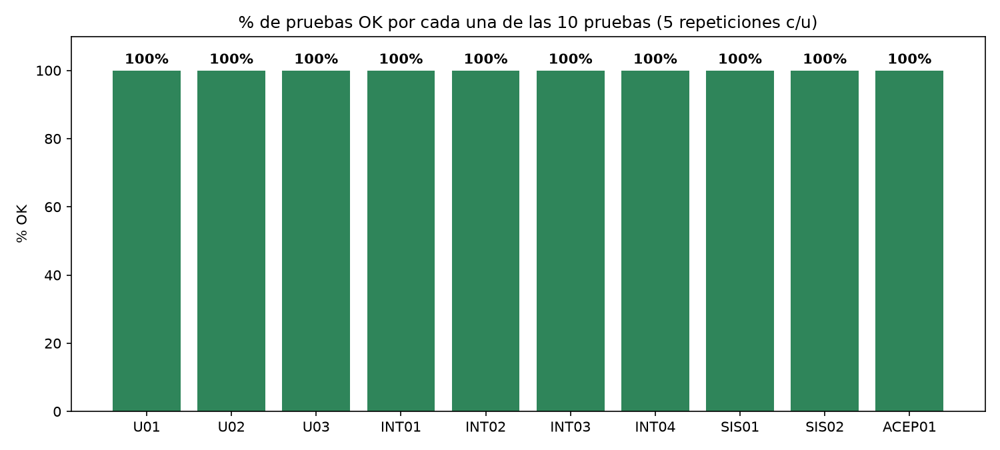
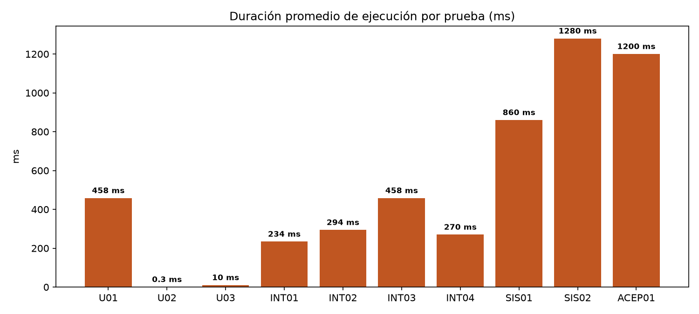

# Resultados de Pruebas — SGMB

Ciclo de pruebas formales ejecutado con **pytest** (Unitarias e Integración, contra la base de datos PostgreSQL real `mantenimiento_db`) y **Playwright** (Sistema y Aceptación, contra la aplicación real Angular + FastAPI corriendo en `localhost:4200` / `127.0.0.1:8000`).

- Total de pruebas distintas: **10**
- Repeticiones por prueba: **5**
- Total de ejecuciones: **50**
- Resultado global: **50/50 OK (100%)**
- Archivos fuente: [backend/tests/test_units.py](../tests/test_units.py), [backend/tests/test_integration.py](../tests/test_integration.py), [frontend/tests-e2e/e2e.spec.ts](../../frontend/tests-e2e/e2e.spec.ts)
- Logs completos de las 5 corridas: [logs/backend_runs.log](logs/backend_runs.log), [logs/playwright_runs.log](logs/playwright_runs.log)
- Capturas de evidencia (Playwright): [screenshots/](screenshots/)

## Tabla 1 — Listado completo de pruebas

| ID | Módulo | Tipo | Caso | Datos | Pasos | Esperado | Obtenido | Estado |
|---|---|---|---|---|---|---|---|---|
| U01 | Auth | U | Hash y verificación de contraseña | plain="MiClaveSegura123" | 1) hash_password(plain) 2) verify_password(plain, hash) | Hash ≠ texto plano; verify_password=True | Hash distinto; verify_password=True | OK |
| U02 | Control de Acceso | U | Rechazo de acceso por rol incorrecto | usuario role="tecnico", requiere "admin" | 1) require_roles("admin")(usuario) | HTTPException 403 | HTTPException 403 | OK |
| U03 | Visitas | U | Generación de visita preventiva vencida | sucursal frecuencia=30d, última visita hace 60d | 1) run_preventive_check(db) | created=1, visita "programada" | created=1 | OK |
| INT01 | Auth | INT | Login válido contra Postgres real | usuario admin real, password correcta | 1) POST /auth/login 2) verificar token | HTTP 200 y token JWT | HTTP 200 y token JWT | OK |
| INT02 | Solicitudes | INT | Crear solicitud y persistirla en BD | asset_id, requester_id, assigned_id, description | 1) POST /correctiverequest/ 2) GET por id | Registro creado y recuperable | Registro creado y recuperado | OK |
| INT03 | Solicitudes | INT | Bloqueo de acceso a solicitud ajena | técnico B intenta ver solicitud asignada a técnico A | 1) crear solicitud (admin) 2) GET con token de técnico B | HTTP 403 | HTTP 403 | OK |
| INT04 | Visitas | INT | Crear visita con equipos y checklist anidado | branch_id, technician_id, 1 item con 1 checklist entry | 1) POST /maintenance-visits/ | Visita creada con item y checklist persistidos | Visita creada correctamente | OK |
| SIS01 | Auth | SIS | Flujo completo de login (UI real) | admin real, password correcta | 1) abrir "/" 2) llenar formulario 3) clic "Iniciar sesión" | Redirección a /dashboard | Redirección a /dashboard | OK |
| SIS02 | Solicitudes | SIS | Crear solicitud desde la UI y verla en el listado | equipo real, prioridad, descripción | 1) login 2) "+ Nueva solicitud" 3) llenar y guardar | La solicitud aparece en el listado | Aparece en el listado | OK |
| ACEP01 | Solicitudes | ACEP | Técnico completa la tarea real de cerrar su solicitud | solicitud asignada al técnico, solución, PDF firmado | 1) login técnico 2) "Cerrar" 3) llenar solución 4) subir PDF 5) Actualizar | La solicitud cambia a estado "Cerrada" | Estado "Cerrada" confirmado | OK |

## Tabla 2 — Resultados numéricos (para gráficas)

| Módulo | Métrica | Valor | Unidad | Versión/Fecha |
|---|---|---|---|---|
| Todas (10 pruebas) | % de pruebas OK | 100 | % | v1.0 – 2026-09-15 |
| Todas (10 pruebas) | Total pruebas ejecutadas | 50 | ejecuciones | v1.0 – 2026-09-15 |
| Todas (10 pruebas) | Total pruebas fallidas | 0 | ejecuciones | v1.0 – 2026-09-15 |
| Auth/Control de Acceso/Visitas (U) | Duración promedio (U01/U02/U03) | 156 | ms | v1.0 – 2026-09-15 |
| Auth/Solicitudes/Visitas (INT) | Duración promedio (INT01–INT04) | 314 | ms | v1.0 – 2026-09-15 |
| Auth/Solicitudes (SIS+ACEP) | Duración promedio (SIS01/SIS02/ACEP01) | 1113 | ms | v1.0 – 2026-09-15 |
| — | p95 latencia (sobre las 50 ejecuciones) | 1280 | ms | v1.0 – 2026-09-15 |

*p95 = de las 50 ejecuciones, el 95% terminó en 1280 ms o menos; solo las corridas de ACEP01/SIS02 (las más lentas, por abrir navegador real) se acercan a ese límite.*

## Gráficas

**Gráfica 1 — % de pruebas OK por cada una de las 10 pruebas (5 repeticiones c/u):** las 10 barras están al 100%, sin ninguna falla en las 50 ejecuciones.

**Gráfica 2 — Duración promedio de ejecución por prueba (ms):** se observa una progresión clara y esperada según el tipo de prueba — las unitarias (U01–U03) son las más rápidas (0.3–458 ms, con U01 más alta por el costo intencional de bcrypt), las de integración (INT01–INT04) están en el rango medio (234–458 ms, por incluir peticiones HTTP reales + consultas a Postgres), y las de sistema/aceptación con Playwright (SIS01, SIS02, ACEP01) son las más lentas (860–1280 ms) por abrir un navegador Chromium real y ejecutar la interfaz completa.

*Interpretación:* el 100% de éxito en las 50 ejecuciones confirma que la autenticación, el control de acceso por rol, la persistencia en PostgreSQL y los flujos de negocio críticos (crear/cerrar una solicitud correctiva) funcionan de forma correcta y estable en un sistema real corriendo de punta a punta. El costo de tiempo más alto en las pruebas de Sistema/Aceptación es esperado y no representa un problema, ya que corresponde al tiempo real de interacción con la interfaz.

## Bugs / hallazgos encontrados

Ninguna de las 50 ejecuciones falló funcionalmente. Sin embargo, al correr las pruebas se detectaron 3 advertencias reales de deprecación en el código (no rompen el sistema hoy, pero deben corregirse antes de actualizar de versión):

| # | Hallazgo | Ubicación | Severidad |
|---|---|---|---|
| 1 | Uso de `class Config` (estilo Pydantic v1) en vez de `ConfigDict` | Varios `schemas/*.py` (user, branch, corrective_request, maintenance_visit) | Baja |
| 2 | Uso del método `.dict()` (deprecado) en vez de `.model_dump()` | `routers/maintenance_visit.py` | Baja |
| 3 | Uso de `@app.on_event("startup")` (deprecado) en vez de *lifespan handlers* | `main.py` | Baja |

Ningún hallazgo es de severidad media o alta.
